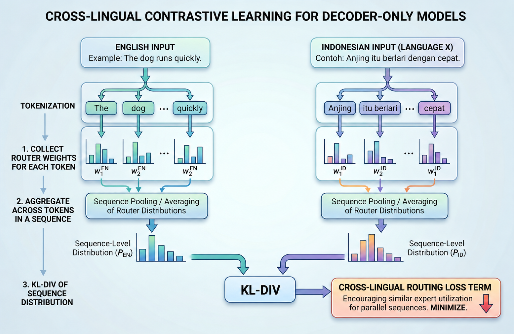

[WIP] This repo is currently being adapted for publication & presentation.

<h1 align="center">Cross-Lingual Alignment for Decoder-Only Models using MoE Routers</h1>

<p align="center">
  <a style="display: inline; max-width: none" href="https://arxiv.org/abs/2610.01921"></a>
</p>

<center>
<p align="center">

</p>
</center>

This repository provides the source code for analysis and experiments in Cross-Lingual Alignment for Decoder-Only Models using MoE Routers. Please contact lucasbandarkar@cs.ucla.edu for questions about the paper or the code.

## Code Organization

- `contrastive_training/` is the main methodological code containing implementation and scripts for MoE routing alignment training. Note that the paper never called this "contrastive training".
- `language_evals/` contains the code for downstream task evaluation.
- `routing_analysis/` contains the code for collecting and analyzing the MoE routing happening in different checkpoints, much of which is inherited from the [Multilingual Routing in Mixture-of-Experts](https://openreview.net/forum?id=ZoZR0x7tTD) project.

## Environments

See `contrastive_training/README.md`, `language_evals/README.md`, and `routing_analysis/README.md` for environment and execution instructions.

This code was developed and tested on remote Linux servers with NVIDIA GPUs and CUDA. Checkpoint and dataset locations can be customized with the environment variables documented in the relevant scripts.

## Warning about Reproducibility

This code was heavily modified for public presentation and may have missing/empty references to files and locations specific to the servers used during the project. The code has not been tested after the removal of private information and has only been used in a single compute environment. The purpose is primarily to be able to replicate the primary methods presented in the paper and not to have the code be usable out-of-the-box.

## Citation:
```bibtex
@misc{bandarkar2026crosslingualalignmentdecoderonlymodels,
      title={Cross-Lingual Alignment for Decoder-Only Models using MoE Routers}, 
      author={Lucas Bandarkar and Clark Peng and Ahmed Haj Ahmed and Aditi Khandelwal and Nanyun Peng},
      year={2026},
      eprint={2610.01921},
      archivePrefix={arXiv},
      primaryClass={cs.CL},
      url={https://arxiv.org/abs/2610.01921}, 
}
```
